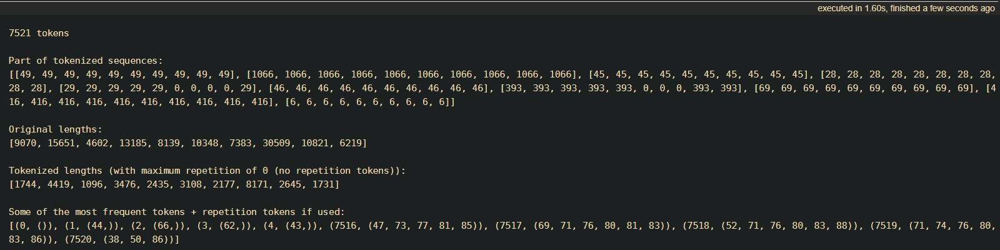
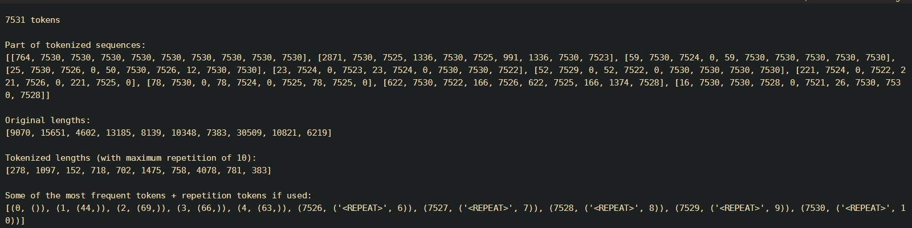
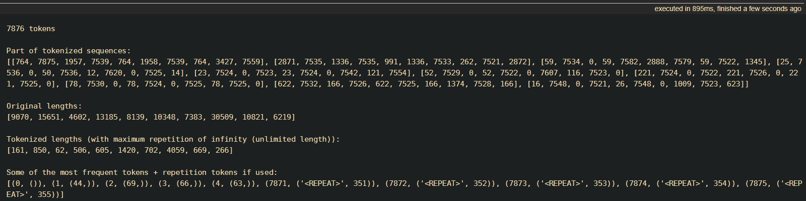
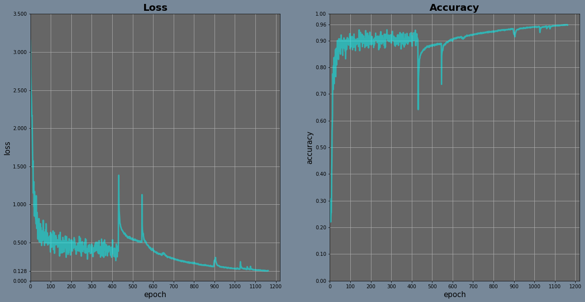
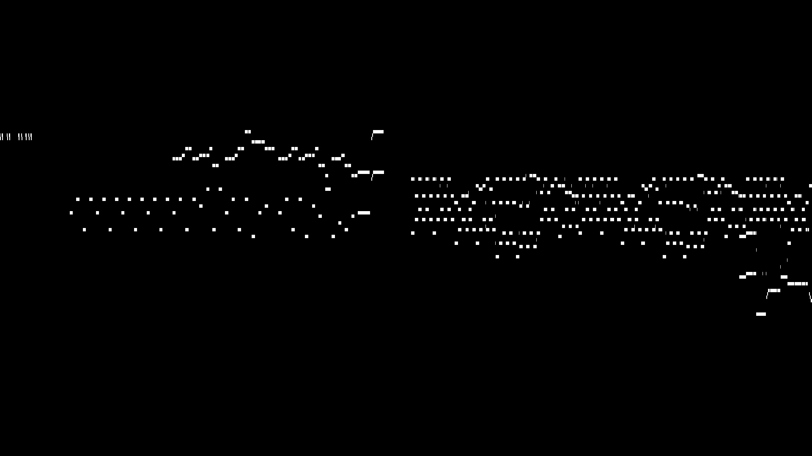
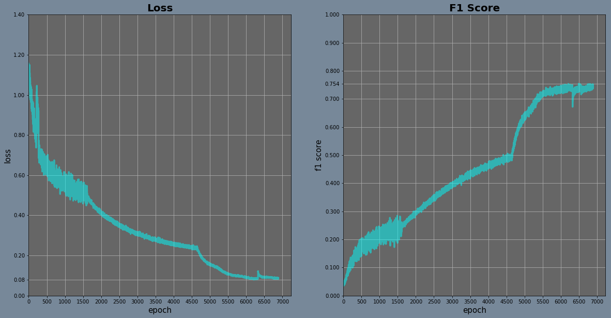
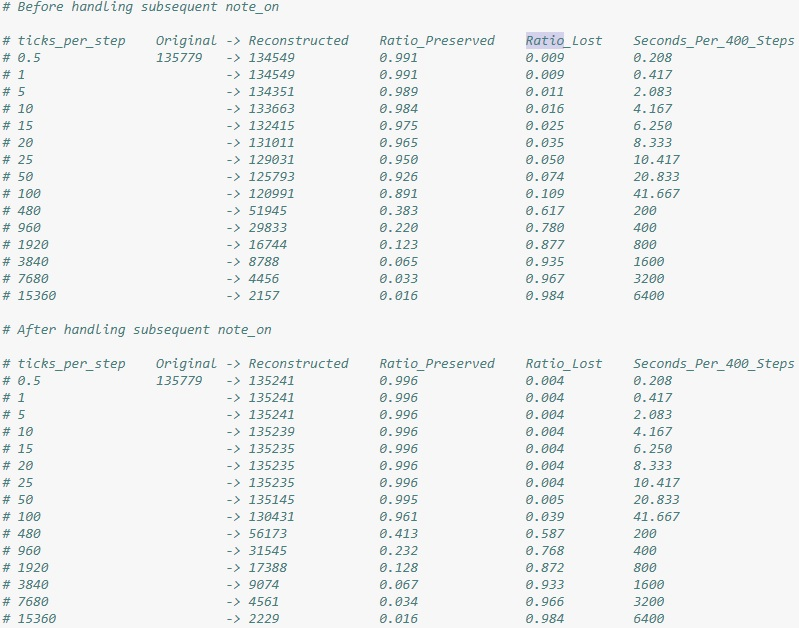
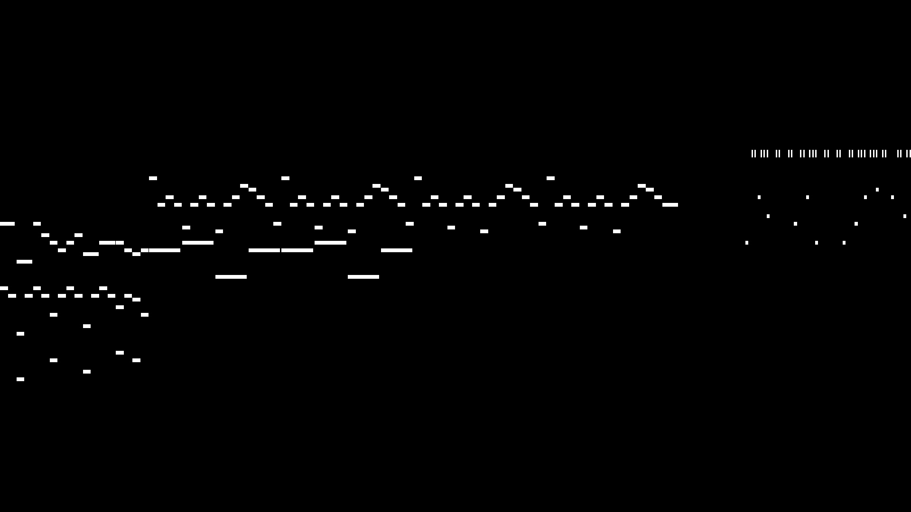
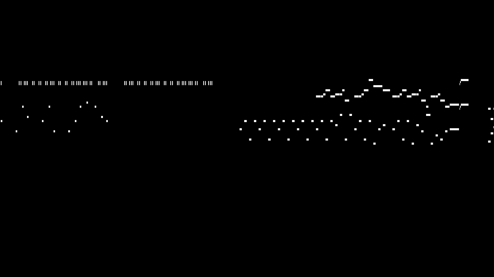

# Undertale Soundtrack Generator

## Description

**Sample results shared in the links [here](#Jan-8th-2019)!**

Still a work in progress!

This is my own project where I try to generate original music based on the official soundtracks for some of my favorite video games: Undertale and Deltarune!

I had set up the utility functions for conversions between csv and text files.

Conversions between midi and csv files are done by a 3rd party program: [midi <-> csv converter](http://www.fourmilab.ch/webtools/midicsv/)

Also, I am using this simple [free midi player](http://falcosoft.hu/softwares.html#midiplayer) to listen to the music from midi files.

Several models using LSTM are built and put into training & experimentation.

Models tried or currently being tried:
* Plain 3-Layer LSTM with 300 units
* 3-Layer LSTM with skip connections (Best Loss, but too much overfitting)
* 8-Layer Deep LSTM (Best Result so far)

Originally used training data source:
* Undertale: Complete OST - https://musescore.com/user/29625/scores/2075346

New training data sources are listed in https://github.com/dragonoken/undertale_deltarune_soundtrack_generator/blob/master/source/source_midi/sources.txt

## To-Do

- [ ] Use [Professor Forcing](https://arxiv.org/abs/1610.09038) method.
  - [ ] Create the Generator and Discriminator models.
    - [x] Create the Generator.
    - [ ] Create the Discriminator.
  - [ ] Implement Professor Forcing training.
    - [x] Implement Free-Running Generation Function.
    - [x] Implement Discriminator Loss.
    - [ ] Implement Generator Loss.
    - [ ] Write a training loop.
    - [ ] Add dynamic plots by writing a separate utility module.
  - [ ] Choose appropriate hyperparameters and train the models.
  - [ ] Generate samples and evaluate the quality.
  - [ ] After some iterations, conclude with my evaluation of this method.

## Requirements and Dependencies

* Python 3.\*
* PyTorch
* Pandas (For [MICI-csv <-> Text] conversion)
* Numpy (For [MICI-csv <-> Text] conversion and visualization)
* Matplotlib (For visualization)
* TQDM (Progress bar)

## Additional Note

`utils` folder contains scripts you can run in a cmd or terminal. These scripts are for conversions between CSV and TXT files, and for visualizing the content.

For conversions between MIDI files and CSV files, download and use the program [here](http://www.fourmilab.ch/webtools/midicsv/).

## Update Logs

---

### July 29th 2019

As I read about the details of Professor Forcing many times, I've noticed that the discriminator part in the paper is quite vague. Getting a single probability output using bidirectional RNN layers doesn't appear straightforward to me. I'm going to look into this particular issue for a bit.

Meanwhile, I'm calling the discriminator **unfinished**.

Besides that, I've just finished the Discriminator Loss Function with the assumption that the discriminator outputs a single value per batch, regardless of the sequence length.

---

### July 28th 2019

Today's plan was to implement the entire Professor Forcing training algorithm, but I ended up just creating the free-running generation function only.

There were some confusions regarding the derivation of the behavior sequence described in the [paper](https://arxiv.org/abs/1610.09038). It seems like I would need to make some changes to the derivation since I would be giving away the answers as part of inputs if I blindly follow the method shown in the paper.

---

### July 27th 2019

I've designed a reasonable Generator and Discriminator models with GRU layers.

In order to do Professor Forcing training in the near future, I've defined the Generator's `forward()` method so that it would optionally return all the hidden states from all GRU layers for all timesteps.

Next step would be the harder—or rather time-consuming—part, since both the Generator and Discriminator models need to be optimized, and the Generator model would have 3 loss terms.

---

### July 26th 2019

I haven't touched this project for a while since March. I was quite busy with school and other programs like the Deep Reinforcement Learning course on Udacity.

Now, I've finally decided to continue this project before it's dead forever.

My second attempt was successful in a sense that my model could reach a high accuracy in rather short time, but the generated samples were much less diverse compared to the ones I got from my first attempt—which I had uploaded [here](https://audiomack.com/album/dragonoken/robots-are-made-of-metal-magic-and-music).

It turns out that it's quite obvious how hard it is to get creative models out of these ways of training; they are trained to **correctly guess what the next note—or chord—is, not necessarilly to be creative.**

So, this time, I decided to try something different: using Professor Forcing.

Simply put, training a sequential model with Professor Forcing methods is like training GANs. Instead of strictly guessing the next note, the generator network learns to _fool_ the discriminator network by making "realistic" samples. This way, the generator should be able to be more creative rather than being just accurate.

---

### Mar 22nd 2019

My intuition was incorrect.

First of all, after using several output methods on a small dataset, I found out that my euclidean-distance-based models were performing significantly worse than just using a single fully-connected layer at the end. Using negative euclidean distances eventually converged to a decent minimum, achieving almost 100% accuracy, but it was slower at doing so. Using the reciprocal of the euclidean distances converged to a terrible minimum, with 60-70% accuracy after 1000 epochs. A simple fully-connected layer, on the other hand, showed rapid decrease in loss and increase in accuracy.

Moreover, matrix multiplication with a fully-connected layer had a much lower memory load than those other options. It seems that it's due to many operations involved in calculating euclidean distances (element-wise subtraction -> square -> sum -> square root) in contrast to a single matrix multiplication.

Also, as I read on several articles on the internet, most people use an embedding dimension of 32, 64, or 128, depending on the number of vocabulary you are using. Considering my relatively "small" vocab size—many language models have like hundreds of thousands of words or so—I can probably go with 32 or even 16. The effect of the large vocabulary size should be canceled out by a small embedding dimension size.

My next goal is to scale it up: make the model deeper and wider. I'm hoping for something creative out of it.

---

### Mar 15th 2019

The dataset and the model are defined.

The dataset contains a list of lists of integers, with each integer being the index of the token at that step and each list being a single soundtrack. Indexing this dataset returns a randomly shuffled copy of the sequence, converted into a 1-D torch.LongTensor. The actual index has nothing to do with this process.

As for the model, the overall architecture contains an embedding layer in the beginning, followed by 3 LSTM RNN layers and a fully connected layer. Through shortcuts, each layer after the embedding layer uses the outputs from the previous layer and the layer before that previous layer. ReLU is used as the activation function for hidden layers and dropouts are applied to the inputs of the recurrent and fully connected layers. Also, layer normalization is applied to the outputs of the recurrent layers.

If I were to use a fully connected layer to directly guess the probability for each token, it will be quite expensive in terms of both computation and memory since the number of tokens is usually very large. So, instead, the final fully connected layer has an output dimension equivalent to the embedding dimension. Euclidean distances are calculated between each output and every embedding vectors of the embedding layer, and the negative values of these distances come out as the output of this whole model. Ideally, it should be possible to use a softmax function on this output to get a decent probability distribution predictions for the target labels.

Whether my intuitions are right or not, I shall find out when I train it...

---

### Mar 10th 2019

In my "*word*" tokenization implementation, in addition to tokenizing common patterns such as chords and notes, I also implemented *repetition tokenization*; repeating the same word for several time steps can be reduced to a word + repetition. (e.g. part of a sequence \[39, 39, 39, 39, 0, 0, 0, 5\] can be further converted into \[39, (<REPEAT>, 3), 0, (<REPEAT>, 2), 5\].)

This resulted in a great reduction of sequence lengths. Most of the sequences showed more than 50% of length reduction using this trick.

* No Repeats (Just word tokenizations)

* Repeats up to 10 (Up to 10 repeats are encoded as one token)

* Unlimited Repeats (Any number of repetition is just one token)

This will greatly help with the training since it reduces long-term dependencies. However, this gives me some extra things to worry about: **1)** will my model overfit because of very short sequences? Or, **2)** will my model struggle because of some possible disruption in patterns of the tokens and repetitions?

To test this empirically, I first need to go and write all the codes necessary for training...

---

### Mar 9th 2019

So far, I have written functioning C++ & CUDA implementations of various LSTM variants—though I'm uncertain about the advantages compared to the vanila PyTorch implementation.

Instead of working on it any further, I decided that it was enough and moved on to writing a fresh notebook in a organized, reproducible way.

I updated the CSV to TXT conversion code so that multiple CSV files in a folder can be converted at once. Then, I created a new IPython Notebook file that would contain all codes for data loading and preprocessing, model definition, training function, and generator function.

I've done the data loading part and partially preprocessing as well. I'm considering using something like word embedding—in this case, taking a single note, chord, or no note as a "word", instead of taking only one note, or "character", at a time. Since a word can contain several notes in it, and note separations are no longer part of the input—because there's always a separator between two "words"—the sequence should get shorter and help the models overcome the chanllenges regarding long-term dependencies.

When I gathered all appearances of notes and chords, I found out there would be almost 8000 "words". Compared to the original 129 note inputs, this is significantly huge. I'm not sure if it would cause memory or training issues; I'll have to figure it out through some experimentations.

---

### Jan 28th 2019

No progress on the project itself, yet.

I'm currently working on implementing several variants of LSTM with PyTorch's C++ interface. When it's done, it will be hopefully better than my previous models.

I still need to work on preprocessing, though. Having larger timesteps in order to reduce the length is under consideration...

While looking through other works on generating music, I read about one case where they trained a model on only one song at a time. So, I'll try that too and see the outcome. Shouldn't take long since it will make the size of the dataset smaller and also reduce the number of patterns to memorize. Yet, I'm aiming for a full training with the entire music at the end.

---

### Jan 8th 2019

First of all, HAPPY NEW YEAR!

I've been keeping myself busy with PyTorch Udacity scholarship challenge, which started on the day before the last update (Nov 9th 2018). This scholarship challenge's last assignment deadline is tomorrow, and I recently finished it with satisfaction. So, I'm planning to continue with this project quite soon.

One more regarding the scholarship program: there's a Side Project Showcase event going on, and I decided to participate with this project. I'll start posting updates on my Facebook and sharing results and samples until I find a way to make my model accessible for other people. (Though I'm not sure if I'll get myself to do that soon)

Speaking of which, I converted one of my best results to a mp3 audio file, selected several parts that were particularly interesting, and then uploaded them all together. I'm sharing the links here:

* Original full soundtrack (approx. 2 hours and 38 minutes): https://audiomack.com/song/dragonoken/generated

* Samples of my choice: https://audiomack.com/album/dragonoken/robots-are-made-of-metal-magic-and-music

Now that there is a sequel(?) of Undertale, Deltarune, I collected new training data! I originally used a single MIDI file that had all the soundtracks in piano version, but I realized that my model learned to play some rather noisy soundtracks as well (like the sound of an elevator...), which was a bit annoying. Now, I have 1 MIDI file for each soundtrack from both Undertale and Deltarune (rearranged for piano by several people on MuseScore). My next challenge will be to put them all together into a single training set...

Looking forward to trying out several techniques I learned and, hopefully, getting better results!

---

### Nov 10th 2018

First of all, I am so embarassed. I realized that I used a Sigmoid activation before using a Softmax, restricting the expressiveness of the model drastically. The lack of learning was due to this setup. In fact, I would say that it was quite miraculous that my model actually ended up learning something. When I removed the last activation functions altogether and used PyTorch's CrossEntropyLoss, they clearly started to learn. There are some images showing some of the improvements below.

By the way, I made the experimentation notebook much cleaner; now it mostly has only the dataset classes, neural nets, and training & predicting & generating sessions. But, it's still more about me trying out things, so the locations for the files might not match.

Also, in addition to my last models, I created another model that has 8 layers of LSTM with 300 units each. I replaced all the training sessions with this deep model and got pretty impressive results:

* Loss and accuracy

* Some of the predicted notes

* Some of the generated notes

While it did get very good at guessing notes one by one, it had some issues with different rhythms playing together (e.g. slow base part and fast treble part). In an attempt to address this problem, I took a new approach: instead of guessing notes one by one, guessing one entire timestep at a time. I created a new dataset to get k-hot vector representations of the notes instead of one-hot vectors. Then, I used Sigmoid instead of Softmax, Binary Cross Entropy Loss instead of normal Cross Entropy Loss, and a threshold instead of the maximum value. In short, the results weren't bad, but they were still dissapointing.

* Loss and accuracy

* Some of the predicted notes

* Some of the generated notes

The rhythm issues were somewhat fixed with it, but the noise got quite severe. More than that, generating from skretch was such a pain. I had to manually set the threshold, add some randomness, and adjust the output values in order to get any reasonable result.

So, I went back to my original character by character model and now I am continuing to train it further. I am trying to see if it can overfit...

---

### Oct 30th 2018

I again created a jupyter notebook -- this time, to get used to pytorch, to try converting texts into training datasets, and to experiment with my own LSTM models. I'm uploading the notebook, but remember that I made it just for me to figure things out... the code is very messy and some will not work at all.

I turned each character in the text, including nextlines, to a one-hot vector representing either a note (1-128) or a timestep (0). The target for each character is the next following character. I checked that it works as I intended, then made a data loader for the training.

As for the neural networks, I created 3 classes: one with only 1 layer of LSTM, 129 inputs and 129 outputs; one with adjustable LSTM layers, input and output dimensions; and one with 3 LSTM layers, layer normalizations, and skip connections.

The first network, the one with only 1 hidden LSTM layer, was not used for the actual training session, but instead, used to check whether the way I made models was correct.

The second one was the one I used a lot. I created 2 instances of it with different hyperparameters; one had 1 LSTM layer with 300 neurons, the other one had 3 layers with 700. I trained both of them for many hours and the results were... disappointing. They all became extremely biased about the data they were given; they ended up guessing one or few specific notes regardless of the inputs they take. With further training and loss weight tweaking, I managed to get the simpler one give more varied results, but they could not generate any 'music'. The 3-layered model generated 0s only, generating empty music. The 1-layered model often gave me the same results, but sometimes created only one chord; three notes pressed at the start and never released...

The negative log likelyhood losses were about 4.5-4.8 in the early part of the training. This loss went down as low as about 1.3 for the simple model. However, the loss for the model with 3 layers stayed above 4 and kept oscilating.

Later, I modified the training code so that the overall accuracy and the the accuracy excluding timesteps (0s) were reported. It allowed me to observe when the model becomes biased -- that is, when it starts to guess only 0s or any single note. With extra information provided, I could clearly see that the models quickly settled with biased states where some local minimas were located. I tried to adjust the loss for each class and add dropouts -- even though it wasn't overfitting -- but they did not improve.

The third model did give me an interesting result. I fixed the number of LSTM layers, and added skip connections and layer normalizations. At first, this model, too, became biased just like others. However, it suddenly escaped from that state and showed a remarkable increase in accuracies. The loss stayed around 3.8, but the accuracies kept increasing. Excited, I let it train overnight and then checked the prediction for the dataset. It was messy, but clearly imitating the music very closely. Strangely, the loss did not decrease much while the overall accuracy reached almost 90%. I let it generate a music from scratch and got shocked; it, too, generated empty music filled with 0s. After manually feeding it some specific note sequences, I realized the problem here. (I'm not 100% sure about this, but) This model became biased in a 'smart way'; it figured out that the next note is likely be the same note as the current note or just 0. Due to the nature of the method I used for preparing the data, this way of making predictions could achieve a very high accuracy.

As to why it happend only to this model and not to the previous models, my guess is that it's due to the skip connections. I think the skip connections allowed the input data to flow fairly unmodified throughout the network, turning the LSTM layers to approximate-identity mapping functions... Though I'm not sure why it did not happened to one of my simple models.

Next, I'm planning to try 2 things: spliting the data into bigger time interval per timestep, and using an adversarial loss. Hopefully, the first method will reduce the repetitions in the data and the second method will force the model to be coherent.

---

### Oct 21st 2018

Adding a parser or two wasn't really that hard! All the essential functions were already laid out in my notebook, so I didn't have much work to do other than making argument parsers and grabing those functions to my scripts!

I probably still need to add more checks for the arguments, but at least it works.

3 Utility scripts are created in the utils folder. Use them in a terminal (e.g. cmd) and see the help documents!

I'll add more functionalities to visualize.py so that it can show the images, not just saving them.

By the way, I'm considering using another module to read and possibly play midi files. It will allow me to do conversions between midi and csv within my project -- and not using other software that might not work in other platforms -- and to directly play the results!

---

### Oct 20th 2018

There was an issue with my conversion code between midi and text: namely, the loss of data. Even when I tried to account for every single timestep, there was some amount of loss in the number of notes.

This turned out to be due to subsequent notes that are only 1 tick away. Because of the structure I was forcing them in, subsequent notes were converted to one long note when I used them to reconstruct the midi csv file.

However, I came up with a solution to this problem without having to change the whole structures of my data. Instead of having subsequent notes combined into one, I droped every other note in those series in order to seperate those notes and minimize the loss.

The result was quite amazing. With 25 ticks per timestep, the ratio of notes lost went down from 5% to 0.4%. Here are the results I gathered before and after this modification:

---

### Oct 19th 2018

It took quite a lot of effort and time for me to understand the components in MIDI files.

I decided to take everything out of them except for the header, end of file, start and end track, and notes; no key signatures, time signatures, tempo change, or any other controls. Moreover, when I turned them into texts, I only took notes and their times.

I started with taking each component out and see how it changes the music. Luckily for me, key signatures and time signatures did not directly impact the sound, so I could just drop them. Some minor controls, such as reverb and sustain, did cause some changes in the music, but they weren't significant so I just dropped them as well.

Tracks were a bit tricky to handle. Notes were separated into 2 tracks. They are played together, but considered as separate parts. To further simplify the format, I removed all Start_tracks and End_tracks other than the ones with lowest time value and highest time value, then changed all track values greater than 1 to 1.

Removing tempo changed the music drastically. Since the pace of a music differed from part to part, having a same tempo throughout the music was... not really good. So, I adjusted all time values according to the tempo changes by stretching and squashing time intervals with different tempos. As a result, even though there is no tempo change, I managed to make the music sound identical to the original one (except I previously removed reverbs and chorus and all).

Also, I successfully visualized the notes and saved them as jpeg images. Here are the first 3 parts of the music, from 0 sec to approximately 156 sec:

After a bit of more testing, I will put the codes into a python script, possibly with argument parsing!

Oh, by the way, I decided not to use the medley. The complete ost midi file is long and good enough for training. I'm planning to augment it later, anyway.

---
### Oct 7th 2018 (just before my bed time)

Inspired by videos by [carykh on YouTube](https://www.youtube.com/user/carykh), I decided to do something similar with one of my favorite game soundtrack: Undertale OST.

After creating the repo, I looked for the right midi files and I found 2 great midi files (one of which had the entire soundtrack played with piano and the other being a shorter medley). Both of them have only piano tracks, which simplifies my job, and are long enough (I hope) to train my neural networks on.

Then, I downloaded a free midi player to actually listen and check those midi files and converted them into csv files so that I can use them as training examples later.

In case you want it, here is that [free midi player](http://falcosoft.hu/softwares.html#midiplayer) and [midi <-> csv converter](http://www.fourmilab.ch/webtools/midicsv/).
